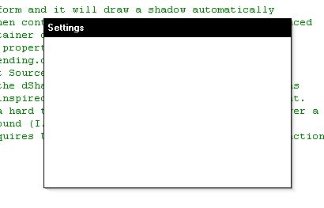



## FormShadow 1\.1

### Description

Drop in OCX control adds an alpha-blended shadow to the bottom and right borders of the containing form. No properties to set or code to add! Just drop and go. Fixed in 1.1 - Shadow artifacts are no longer left on forms brought to the foreground and the shadows are now correctly repainting when bringing the containing form to the foreground.
 
### More Info
 

             |
---                |---
**Submitted On**   |2001-07-20 11:00:14
**By**             |[Owen Graupman](https://github.com/Planet-Source-Code/PSCIndex/blob/master/ByAuthor/owen-graupman.md)
**Level**          |Intermediate
**User Rating**    |4.5 (18 globes from 4 users)
**Compatibility**  |VB 6\.0
**Category**       |[Custom Controls/ Forms/  Menus](https://github.com/Planet-Source-Code/PSCIndex/blob/master/ByCategory/custom-controls-forms-menus__1-4.md)
**World**          |[Visual Basic](https://github.com/Planet-Source-Code/PSCIndex/blob/master/ByWorld/visual-basic.md)
**Archive File**   |[FormShadow231597202001\.zip](https://github.com/Planet-Source-Code/owen-graupman-formshadow-1-1__1-25257/archive/master.zip)

